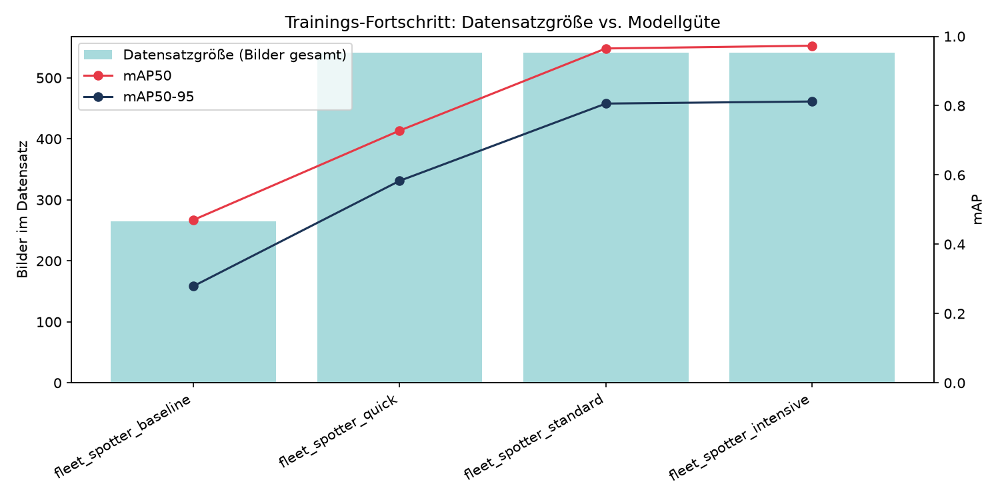

# Wiener Linien Fleet Spotter

> **KI-gestützte Erkennung und Klassifizierung von Wiener Straßenbahnen & U-Bahnen**
>
> Universitätskurs „Machine Learning" · Abgabe 18. Juni 2026

---

## Projektübersicht

Der **Wiener Linien Fleet Spotter** ist ein prototypisches Computer-Vision-System, das Schienenfahrzeuge des Wiener öffentlichen Nahverkehrs nicht nur erkennt, sondern bis auf die spezifische **Baureihe und Fahrzeuggeneration** klassifiziert. Das Modell basiert auf **YOLOv8 mit Transfer Learning** und wird auf einem eigens annotierten Datensatz von Wiener Linien-Fahrzeugen fine-getuned.

### Zielklassen

| Klasse | Typ | Beschreibung |
|---|---|---|
| `E2-Tram` | Straßenbahn | Hochflur-Klassiker (Bj. 1978–1990), eckiges Design, oft mit Beiwagen |
| `ULF` | Straßenbahn | Ultra Low Floor, charakteristische runde graue Front (ab 2000) |
| `Flexity` | Straßenbahn | Modernes Niederflurfahrzeug mit LED-Anzeigen (ab 2018) |
| `Silberpfeil` | U-Bahn | Unlackierte Aluminium-Optik, kantige Front (ab 1978) |
| `V-Wagen` | U-Bahn | Rot-weiß, durchgängig begehbar (ab 2000) |
| `X-Wagen` | U-Bahn | Vollautomatisch, L-förmige LED-Signatur (ab 2024) |

---

## Schnellstart

### Voraussetzungen

- Python 3.10+
- pip
- *(Optional für GPU-Training: CUDA 11.8+)*

### Installation

```bash
# 1. Repository klonen
git clone https://github.com/<your-org>/wiener-linien-fleet-spotter.git
cd wiener-linien-fleet-spotter

# 2. Virtuelle Umgebung erstellen (empfohlen)
python -m venv venv
source venv/bin/activate        # Windows: venv\Scripts\activate

# 3. Abhängigkeiten installieren
pip install -r requirements.txt
```

### Demo-App starten

```bash
streamlit run app/app.py
```

Browser öffnet sich automatisch auf `http://localhost:8501`.
Ein Bild hochladen → Fahrzeuge werden erkannt und klassifiziert.

In der Seitenleiste stehen folgende Einstellungen zur Verfügung:

- **Trainings-Run**: Auswahl, welches trainierte Modell (`model/runs/*/weights/best.pt`) für die Erkennung verwendet wird – inkl. Modellgröße, Epochenzahl, Batch-Size und Datum je Run. Ohne trainierten Run läuft die App im Demo-Modus.
- **Konfidenz-/IoU-Schwellwert**: Steuern Mindestvertrauen und Non-Maximum-Suppression der Erkennungen.
- **Label-/Konfidenz-Anzeige**: Ein-/Ausblenden von Klassennamen und Wahrscheinlichkeiten auf dem Bild.
- **Erklärbarkeits-Heatmap (Grad-CAM)**: Für jedes erkannte Fahrzeug wird per Backpropagation ermittelt, welche Bildbereiche am stärksten für seine vorhergesagte Klasse gesprochen haben – also die tatsächliche Evidenz hinter der Entscheidung. Dargestellt als Entscheidungs-Overlay und reine Heatmap, inklusive Konturmarkierung der einflussreichsten Bereiche, einstellbarer Intensität und wählbarem Detailgrad (feine P3- bis grobe P5-Feature-Ebenen).

> **Hinweis:** Ohne trainiertes Modell läuft die App im *Demo-Modus* mit einem allgemeinen YOLOv8-Modell. Die Wiener-Linien-Klassen werden erst nach dem Training erkannt.

---

## Vollständiger Workflow

### 1 · Datensatz vorbereiten

Bilder werden mit [Roboflow](https://roboflow.com) oder [CVAT](https://cvat.org) annotiert (Bounding Boxes + Klassen-Labels im YOLO-Format).

Verzeichnisstruktur nach der Annotation:

```
data/
├── annotated/
│   ├── train/
│   │   ├── images/   # *.jpg, *.png
│   │   └── labels/   # *.txt (YOLO format)
│   ├── valid/
│   └── test/
└── dataset.yaml      # Klassen-Konfiguration
```

### 2 · Augmentierung (optional, empfohlen bei wenig Daten)

```bash
python scripts/augment.py --factor 3
# → verdreifacht den Trainingsdatensatz durch Helligkeits-,
#   Rotations-, Regen- und Nebeleffekte
```

### 3 · Modell trainieren

```bash
# Schnell (CPU / wenig VRAM): yolov8n
python scripts/train.py --model yolov8n.pt --epochs 50

# Besser (GPU empfohlen): yolov8s oder yolov8m
python scripts/train.py --model yolov8s.pt --epochs 100 --batch 32
```

Trainings-Artefakte (Gewichte, Metriken, Plots) landen in:
`model/runs/fleet_spotter_v1/`

### 4 · Evaluierung

```bash
python scripts/evaluate.py
# → druckt per-Klasse AP50, mAP50-95, F1-Score
# → speichert model/runs/fleet_spotter_v1/evaluation_report.txt
```

### 5 · EDA & visuelle Inspektion

```bash
jupyter notebook notebooks/eda_annotation_check.ipynb
```

### 6 · Trainings-Läufe vergleichen

```bash
python scripts/compare_runs.py
```

Stellt alle abgeschlossenen Runs in `model/runs/` (mind. `MIN_EPOCHS` durchlaufene Epochen) gegenüber – inkl. Modell, Epochenzahl, Datensatzgröße zum jeweiligen Trainingszeitpunkt (rekonstruiert aus der Git-Historie von `data/annotated/`) und den finalen Metriken (Precision, Recall, mAP50, mAP50-95). Ergebnis:

- `model/runs/comparison.csv` – Tabelle aller Runs
- `model/runs/comparison.png` – Diagramm „Datensatzgröße vs. Modellgüte"

Damit lässt sich der Projektfortschritt nachvollziehen, von kleinen, schnellen Testläufen bis zum finalen Modell.

---

## Ergebnisse

Aktueller Stand der Trainings-Runs (siehe `model/runs/comparison.csv`):

| Run | Modell | Epochen | Datensatz | Bilder gesamt | Precision | Recall | mAP50 | mAP50-95 |
|---|---|---|---|---|---|---|---|---|
| `fleet_spotter_baseline` | yolov8s | 20/100 (abgebrochen) | vorherig | 265 | 0,385 | 0,538 | 0,470 | 0,279 |
| `fleet_spotter_quick` | yolov8n | 5/5 | aktuell | 541 | 0,687 | 0,649 | 0,728 | 0,583 |
| `fleet_spotter_standard` | yolov8n | 50/50 | aktuell | 541 | 0,930 | 0,930 | 0,965 | 0,806 |
| `fleet_spotter_intensive` | yolov8s | 87/100 | aktuell | 541 | 0,951 | 0,935 | 0,973 | 0,812 |

Der Vergleich zeigt deutlich den Effekt des erweiterten Datensatzes und der Trainingsdauer: Mit nur 265 annotierten Bildern (vor dem Commit „new data") erreichte selbst ein 20-Epochen-Lauf nur mAP50 = 0,470. Nach Erweiterung auf 541 Bilder reicht schon ein kurzer 5-Epochen-Lauf (`fleet_spotter_quick`) für mAP50 = 0,728 – mit mehr Epochen steigt der Wert auf bis zu **0,973** (`fleet_spotter_intensive`, YOLOv8s, 87/100 Epochen, mAP50-95 = 0,812), dem aktuell besten Modell und der Standardauswahl in der Demo-App.

In der App lassen sich alle vier Runs über die Sidebar auswählen, gruppiert nach Datensatzversion ("Aktueller Datensatz" / "Vorheriger Datensatz").



---

## Projektstruktur

```
wiener-linien-fleet-spotter/
├── app/
│   └── app.py                  # Streamlit Web-UI
├── data/
│   ├── annotated/              # Annotierter Datensatz (gitignored)
│   ├── augmented/              # Augmentierte Bilder (gitignored)
│   └── dataset.yaml            # YOLO-Datensatz-Konfiguration
├── model/
│   └── runs/                   # Trainings-Output (Gewichte gitignored, außer best.pt)
│       ├── comparison.csv      # Tabelle aller Trainings-Runs
│       └── comparison.png      # Diagramm: Datensatzgröße vs. Modellgüte
├── notebooks/
│   └── eda_annotation_check.ipynb
├── scripts/
│   ├── train.py                # Training
│   ├── evaluate.py             # Evaluierung
│   ├── augment.py              # Offline-Augmentierung
│   ├── compare_runs.py         # Vergleich aller Trainings-Runs
│   └── dataset_info.py         # Helper: Datensatzgröße aus Git-Historie
├── assets/                     # Bilder, Logos für Dokumentation
├── requirements.txt
├── .gitignore
└── README.md
```

---

## Technischer Ansatz

| Aspekt | Details |
|---|---|
| **Backbone** | YOLOv8n / YOLOv8s (via `ultralytics`) |
| **Methode** | Transfer Learning + Fine-Tuning |
| **Augmentierung** | Helligkeit, Kontrast, Regen, Nebel, Schatten, horizontaler Flip, leichte Rotation |
| **Metriken** | mAP50, mAP50-95, Precision, Recall, F1 |
| **UI** | Streamlit – Modell-Auswahl, Upload → Echtzeit-Inferenz mit Bounding Boxes |
| **Erklärbarkeit** | Grad-CAM-Heatmaps pro Erkennung (P3/P4/P5-Feature-Ebenen) |
| **Run-Vergleich** | `scripts/compare_runs.py` – Tabelle & Diagramm über alle Trainings-Runs |

---

## Team

Vierergruppe, Universitätskurs „Machine Learning", Sommersemester 2026

---

## Lizenz

MIT License – Bildmaterial nur für akademische Zwecke, keine kommerzielle Nutzung.
